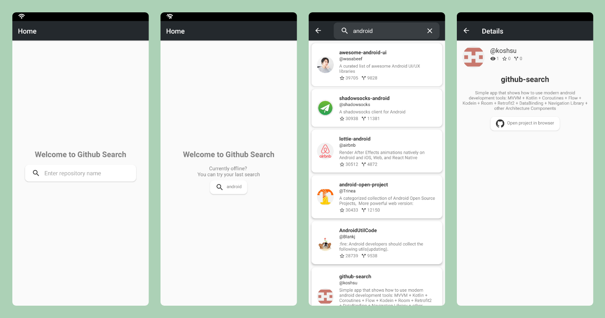
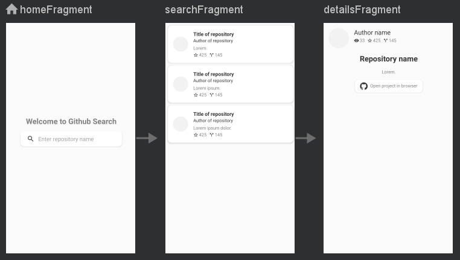

# About
**Github Search** is a simple Android application built to demonstrate use of modern Android development tools.

***Install and test latest version by link below 👇***

[](https://github.com/koshsu/github-search/releases/latest/download/github_search.apk)


# App Screenshots



# What's under the hood
* Architecture: [MVVM](https://developer.android.com/jetpack/guide#recommended-app-arch) (Model View View-Model)


* [Navigation](https://developer.android.com/guide/navigation) Graph



* App is written in [Kotlin](https://developer.android.com/kotlin)
* [Coroutines](https://developer.android.com/kotlin/coroutines) (concurrency)
* [Kodein-DI](https://kodein.org/di/) - "painless" Dependency Injection


# Project Structure
```
com.koshsu.githubsearch     # Root Package
    .
    ├── application         # Custom Application class / Dependency Injection (Kodein)
    |
    ├── data                # Data handling
    |   ├── database        # Room database for local end point
    |   |   ├── dao         # Data Access Objects for Room 
    |   |   └── model       # Entities and data classes
    |   ├── network         # Retrofit/Github API for remote end point
    |   |   └── response    # Data class that holds search result data
    |   ├── preference      # Shared Preferences Provider
    |   └── repository      # Single source of data for ViewModels
    |
    ├── ui                  # View layer (Activity, Fragments)
    │   ├── details         # Details Screen Fragment (& ViewModel)
    │   ├── home            # Home Screen Fragment
    |   ├── interfaces      # Interfaces for communication between Fragments and Activity
    │   └── search          # Search Screen Fragment (& ViewModel, Adapter)
    |
    └── utils               # Kotlin extensions / Utility classes 
```


#### To-dos:
- Pagination
- Tests 